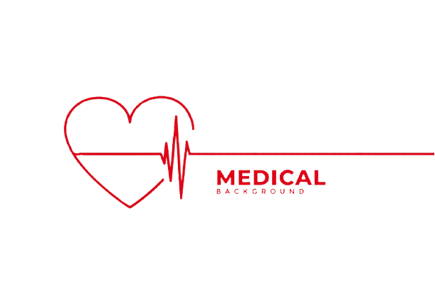
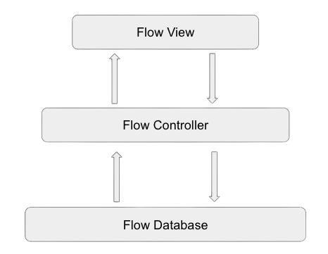
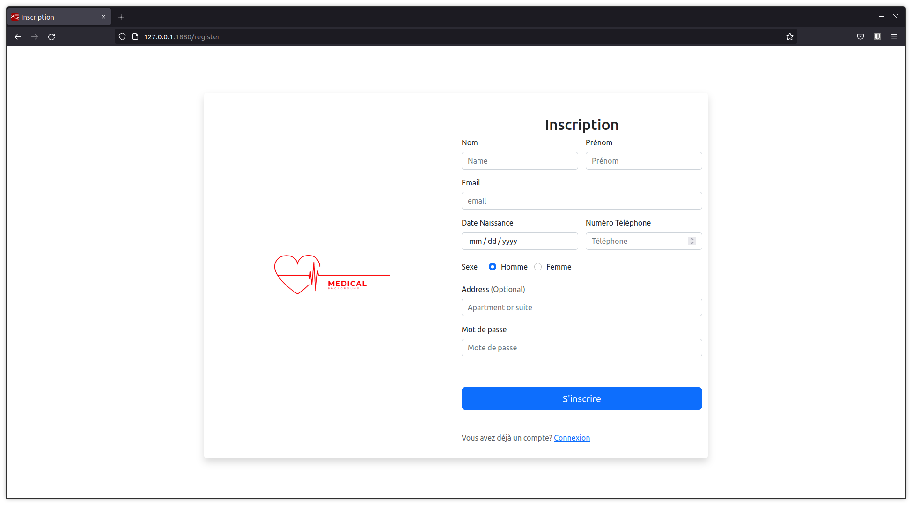
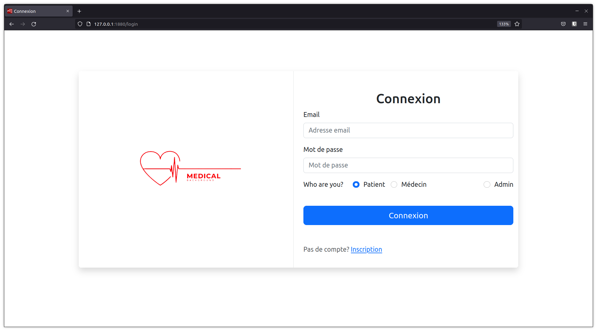
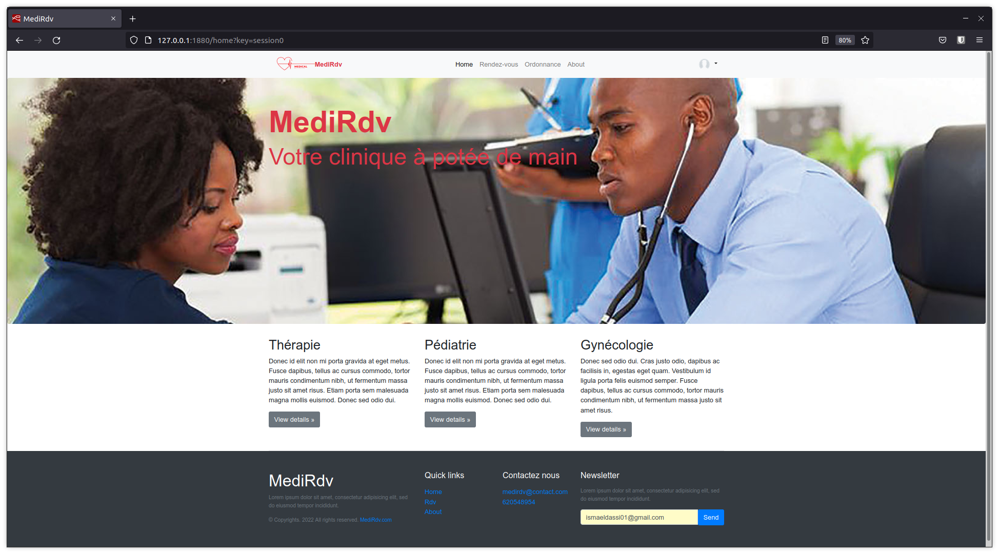

# Medi-Rdv

**Medi-rdv** is a web application for making online medical appointments powered by **[Node-Red](https://nodered.org)**.

## Tools

To make this applicaiton, we used many tools amount which:

- HTML
- CSS
- Bootstrap
- JavaScript
- MySQL
- AWS SES

## Diagrams

In the project tree, we have the class diagram drawn from the [Draw.io Integration](https://marketplace.visualstudio.com/items?itemName=hediet.vscode-drawio) and [ERD editor](https://marketplace.visualstudio.com/items?itemName=dineug.vuerd-vscode) extensions on VS Code. Respectively in the following files:

- [class-diagram.drawio](class-diagram.drawio)

- [erd-class-diagram.vuerd.json](erd-class-diagram.vuerd.json)

## Architecture

Below this is a preview of the structure of this application:

## Overwiew

[http://127.0.0.1:1880/home](http://127.0.0.1:1880)

## Author

[Ismael Messa](https://messaismael.com/aboutme/)
